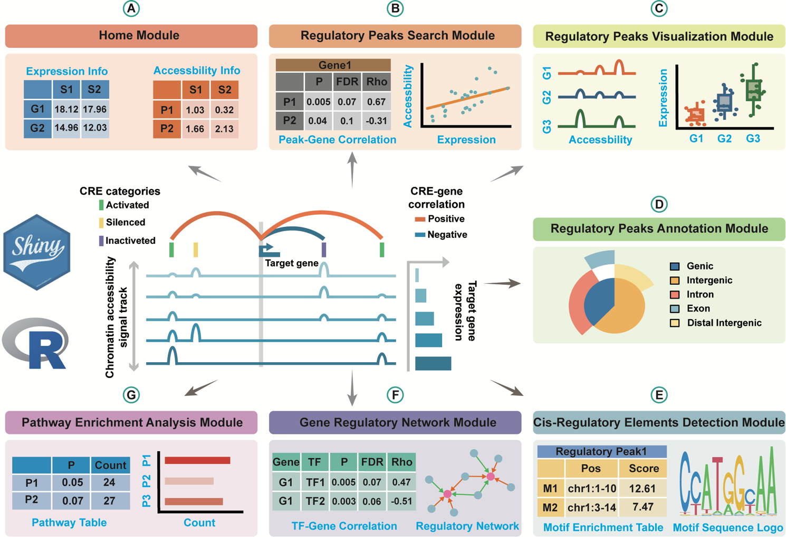

[](https://xulabgdpu.org.cn/linkage/) [](https://doi.org/10.1101/2024.04.24.590756) [](https://github.com/linkage)


Linkage is a user-friendly, interactive, open-source R-Shiny web application for exploring and visualizing potential gene cis-regulatory elements (CREs) based on ATAC-seq and RNA-seq data. Users can upload customized data or re-analysis public datasets, then obtain genome-wide CREs with simple clicks. All the CREs are predicted from multi-omics sequencing data, rather than being experimentally determined. The main feature for Linkage is to identify potential CREs for the whole genome by performing canonical correlation analysis between each quantitative chromatin accessibility measure and the quantitative expression level across all samples. Additional modules are developed to allow users to perform more systematic and deeper analysis for the gene regulatory landscape.

 The Shiny application is additionally hosted at <https://xulabgdpu.org.cn/linkage>.


## Insallation

### 1. Download Linkage Source Code
  + Download Linkage from the [https://github.com/luoyyyy/Linkage](https://github.com/luoyyyy/Linkage).

    Or
  + ```r
    git clone https://github.com/luoyyyy/Linkage.git
    ```
### 2. Install Required R Packages
  + Open the R environment or R GUI of your choice and run the following code to install the required R packages ( all necessary packages and their version information can be found in the [sessioninfo](https://github.com/luoyyyy/Linkage/blob/main/sessionInfo) ) :
    ```r
    install.packages(c("Seurat","shiny","shinyBS","ggplot2","clusterProfiler","BSgenome.Hsapiens.UCSC.hg38","DT"))
    ```
  + Alternatively, the project environment required for Linkage can be reproduced using the renv.lock, .Rprofile and activate.R files.

    Create a project and run the following command in the project directory :

    ```r
    install.package("renv")
    renv::init()
    ```
    After running the command, you will see the following directory structure :
    ```bash
    |- renv/
    |- renv.lock
    |- .Rprofile
    ```
    Replace the renv.lock and .Rprofile files in your current directory with the versions provided in the GitHub repository, then run the following command to restore the project environment.
    ```r
    renv::restore()
    ```
    During the execution of the above command, the process may be interrupted due to failure in downloading certain packages. you can manually install the failed packages and then re-run "renv::restore()" to continue restoring the environment.


